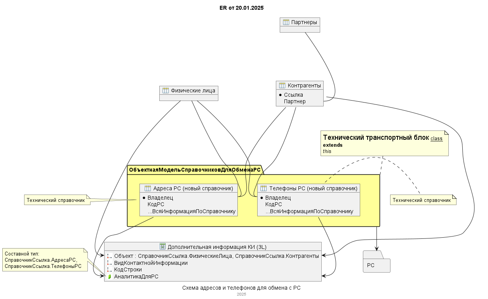
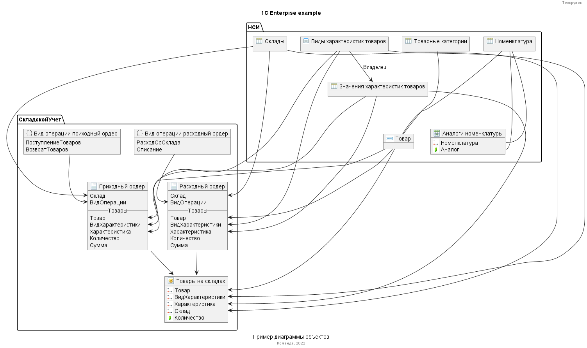

# Спрайты для диаграммы ER-типа под 1С (1ce-icons-for-plantuml)
Это расширенный форк на https://github.com/plastinin/1ce-icons-for-plantuml
Набор спрайтов и макросов по объектам платформы 1С:Предприятие для использования в диаграммах PlantUML.

Отличия от базового:
- Возможность для подключения указывать одну рабочую ссылку:
"!include https://raw.githubusercontent.com/Kyrales/1C-ER-plantuml/refs/heads/extended/main.puml"





## Начало работы

D начале _вашего_ puml-файла добавить директивы импорта (обращайте внимание на версию):

```
!include https://raw.githubusercontent.com/Kyrales/1C-ER-plantuml/refs/heads/extended/main.puml

и т.д.
```

## Основная документация

Набор спрайтов сделан на основе базовой библиотеки "Диаграмы классов" https://plantuml.com/ru/class-diagram
Все доп.возможности можно использовать из описания к данной библиотеке.
